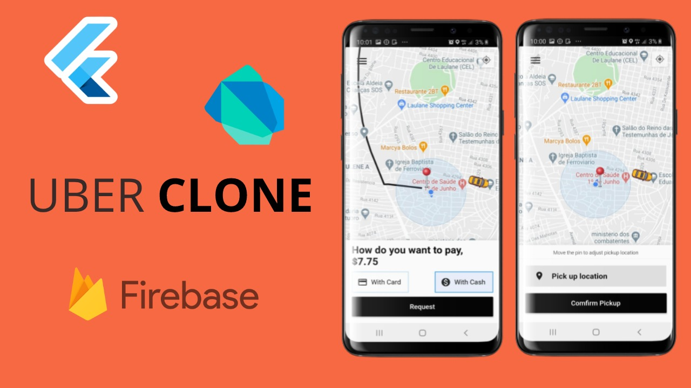

# Flutter Uber Clone / Taxi App

## Getting Started

Get the apk for this project at this [link](https://flutter.io/docs/get-started/codelab)

There are mainly two aspects to consider in order to have this project working:
1. Don't forget to add your own google maps api into the androidmanifest.xml file
2. This is not requered but you can conect the project to your firebase project by chamging the google-services.json file

